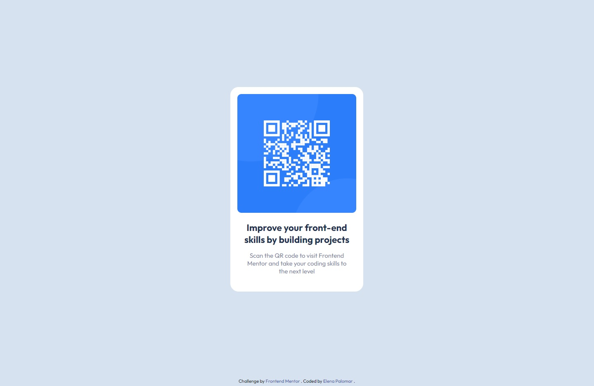

# Frontend Mentor - QR code component solution

## Welcome! 👋

Thanks for checking out this front-end coding challenge.

This is a solution to the [QR code component challenge on Frontend Mentor](https://www.frontendmentor.io/challenges/qr-code-component-iux_sIO_H). Frontend Mentor challenges help you improve your coding skills by building realistic projects.

## Table of contents

- [Overview](#overview)
  - [Screenshot](#screenshot)
  - [Links](#links)
- [Built with](#built-with)
- [Author](#author)

**Note: Delete this note and update the table of contents based on what sections you keep.**

## Overview

### Screenshot

-><-
-><-

### Links

- [Solution URL](https://github.com/ElenaPalomar/qr-code-component)
- [Live Site URL](https://elenapalomar.github.io/qr-code-component/)

## My process

### Built with

- Semantic HTML5 markup
- CSS custom properties
- Flexbox
- Mobile-first workflow

## Author

- Frontend Mentor - [@ElenaPalomar](https://www.frontendmentor.io/profile/ElenaPalomar)
- GitHub - [ElenaPalomar](https://github.com/search?q=ElenaPalomar)
